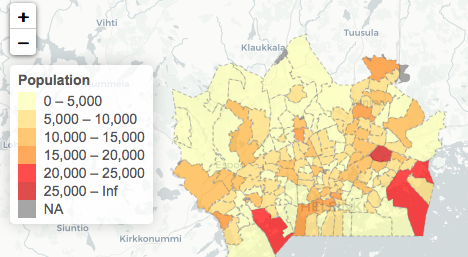

## About The Application

This Shiny application is a vizualization of some statistics about Helsinki Capital Region (Finland), i.e. number of inhabitants, their gender and age structure, and median income by each postal code/ district.

I am a big fan of spatial analysis and vizualizing the data on an interactive map, even though I do not have any experience in GIS software (geographic information system). I have tried different R packages and methods, without any good results. 

In my experience, one of the most challenging parts is to get a good Shape file for the region that you want to vizualize (usually only the U.S or European country map are available but not at a country or city level). What is more difficult is to match your data with the shape file, figuring all the longtitute and latitute right to project it on a Google or Open Street Map.

Fortunately this time I have found a good shape file provided by Helsinki Region Environmental Services Authority HSY and compatible data set by Statistics Finland. Next I will present the main features of the Shiny app.

--- .class #id 

## Leaflet Mapping

The main feature of this Shiny application is the interactive map, which you can hover the mouse over the highlighted polygons and get the statistics of the choosen district. In order to make this map, my tool box includes:
- R packages: rgdal, leaflet & dplyr
- A shapefile of Helsinki Region including district name and postal code.
- Paavo open data set by Statistics Finland

--- .class #id 

## Shiny app elements

Below is the list of UI elements with their corresponding events & reactions that I create in this Shiny app.

1. A map that renders the capital region shapefile on top of Open Street Map using Leaflet
2. A RadioButton list for the 4 cities comprising the capital region.
  - When user choose a city, it will subset the data and shapefile to that city
3. Another RadioButton list for 2 metrics that users can choose either 'Population' or 'Median Income/Year' to be visualized by the map.
4. Two Plotly interactive plots rendered whenever user choose a city/district
  - A pie chart showing gender proportion
  - A histogram for age groups

--- .class #id  
## References

1. [Link to my Shiny app](https://hoangt2.shinyapps.io/HelsinkiRegionStat/)

2. [Link to Github repo](https://github.com/hoangt2/Helsinki-Region-Statistics)

3. [Helsinki Region shapefile by HSY ](https://www.hsy.fi/fi/asiantuntijalle/seututieto/paikkatiedot/kartta-aineistot/taustakartat/Sivut/paakaupunkiseudunpostinumeroalueet.aspx)

4. [Paavo Open Dataset by Statistics Finland](https://www.stat.fi/tup/paavo/index.html)

5. [Reference article about transforming and plotting shapefile on top of basemap](https://www.r-bloggers.com/shapefile-polygons-plotted-on-google-maps-using-ggmap-in-r-throw-some-throw-some-stats-on-that-mappart-2/)
